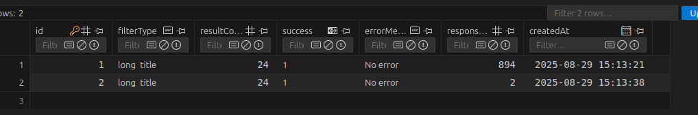

# News Scraper

A Nest.js project that scrapes the first 30 entries from [Hacker News](https://news.ycombinator.com/) and provides filtered results via API endpoints. Usage data is logged to a SQLite database.

## Features

- Scrape Hacker News for:
  - Rank/number
  - Title
  - Points
  - Number of comments
- Filter entries:
  - Titles with more than 5 words → sorted by comments descending
  - Titles with 5 or fewer words → sorted by points descending
- Log each filter request with timestamp and applied filter

## Technologies

- Nest.js
- TypeScript
- Axios (HTTP requests)
- Cheerio (HTML parsing)
- TypeORM + SQLite (usage logging)
- Jest + Supertest (testing)

## Setup

1. Clone the repository:
   ```bash
   git clone https://github.com/CRBM84/news-scaper.git
   cd news-scaper

2. Install dependencies:
   ```bash
   npm install
3. Run the application:
   ```bash
   npm run start:dev

## API Endpoints
1. GET /crawler/scrape
2. GET /crawler/long-titles
3. GET /crawler/short-titles

## Caching
The post titles fetched are persisted in SQLite, effectively serving as a simple cache. In a real-world production environment, with remote db (MySQL, MongoDB etc.), I would implement an in-memory cache to reduce latency and database load.

The screenshot below shows a long-title api fetching from Hacker News vs using cached data.

## Testing
  ```bash
   npm run start:dev